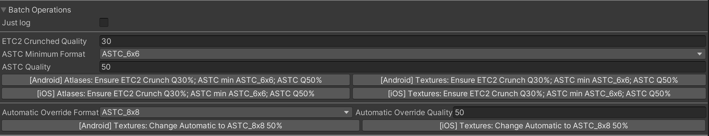
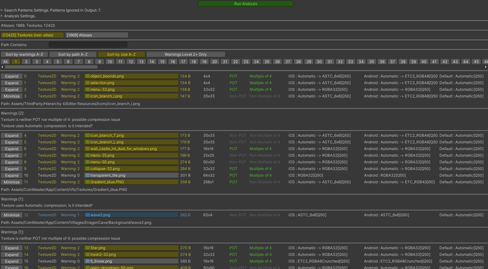
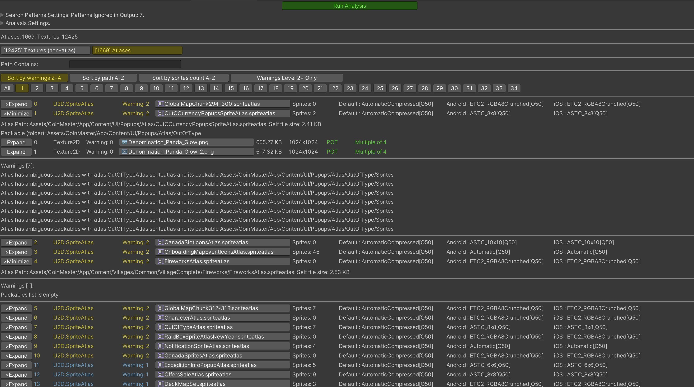

# Textures Hunter Unity3D Tool 

##
This tool provides summary of all textures in Unity project.

It performs an analysis of atlas and non-atlas textures to give some recommendations upon their compression settings:
e.g. detect issues like
- Only POT textures can be compressed to PVRTC format
- Only textures with width/height being multiple of 4 can be compressed to Crunch format
- etc

It also helps to analyze all your atlases at once and highlights issues like
- if their textures used in Resources and/or Addressables (which may lead to duplicated textures in build)
- if there are some ambiguous settings between atlases
- etc

You can set recommended compression settings and it will mark textures and atlases that do not use them.

All code combined into one script for easier portability.
So you can just copy-paste [TextureHunter.cs](./Packages/TextureHunter/Editor/TextureHunter.cs) to your project in any Editor folder.

Use "Tools/Texture Hunter" menu to launch it.

## What it checks

Texture warnings include:

- Compression compatibility problems, such as PVRTC requiring power-of-two textures or Crunch requiring width/height divisible by 4.
- Textures larger than recommended limits.
- Read/write and mipmap settings that may be unwanted for runtime content.
- Missing platform overrides or import settings that differ from the recommended configuration.

Atlas warnings include:

- Ambiguous atlas packables where different atlases may include the same texture.
- Textures that appear in more than one atlas.
- Atlas textures that are also in `Resources` or Addressables, which can cause duplicate texture data in a build.
- Double-compression risks when a texture is already compressed and then packed into a compressed atlas.

## Working with results

The window has separate Textures and Atlases views.
Both views support path filtering, warning-level filtering, sorting, and pagination for large projects.

Use `Warnings Level 2+ Only` to focus on stronger recommendations first.

## Batch operations

Batch operations can apply importer fixes to textures or atlases in bulk.
Enable `Just log` first to preview the changes in the Console without saving anything.
When `Just log` is disabled, applied operations write importer changes and save assets.

## Analysis settings

Important settings that affect results:

- `Try Detect Addressables` uses reflection on Addressables settings so textures that are both packed in atlases and marked Addressable can be flagged as possible build duplicates.
- Warning toggles control which import settings are treated as issues during analysis.
- `Garbage Collect Step` can reduce memory pressure in huge projects by periodically collecting during analysis.
- `Debug Limit` limits how many atlases/textures are processed, which is useful while testing settings on very large projects.

##### Textures View

 

##### Atlases View

 

## Installation

 1. Just copy and paste file [TextureHunter.cs](./Packages/TextureHunter/Editor/TextureHunter.cs) inside Editor folder
 2. via Unity's Package Manager. Add as https://github.com/AlexeyPerov/Unity-Textures-Hunter.git

---

## Contributions

Feel free to report bugs, request new features
or to contribute to this project!

---

## Other tools

##### Unity Scanner

- To analyze the whole project for various issues [Unity-Scanner](https://github.com/AlexeyPerov/Unity-Scanner).

##### Dependencies Hunter

- To find unreferenced assets in Unity project see [Dependencies-Hunter](https://github.com/AlexeyPerov/Unity-Dependencies-Hunter).

##### Addressables Inspector

- To analyze addressables layout [Addressables-Inspector](https://github.com/AlexeyPerov/Unity-Addressables-Inspector).

##### Missing References Hunter

- To find missing or empty references in your assets see [Missing-References-Hunter](https://github.com/AlexeyPerov/Unity-MissingReferences-Hunter).

##### Materials Hunter

- To analyze your materials and renderers see [Materials-Hunter](https://github.com/AlexeyPerov/Unity-Materials-Hunter).

##### Asset Inspector

- To analyze asset dependencies [Asset-Inspector](https://github.com/AlexeyPerov/Unity-Asset-Inspector).

##### Editor Coroutines

- Unity Editor Coroutines alternative version [Lite-Editor-Coroutines](https://github.com/AlexeyPerov/Unity-Lite-Editor-Coroutines).
- Simplified and compact version [Pocket-Editor-Coroutines](https://github.com/AlexeyPerov/Unity-Pocket-Editor-Coroutines).
