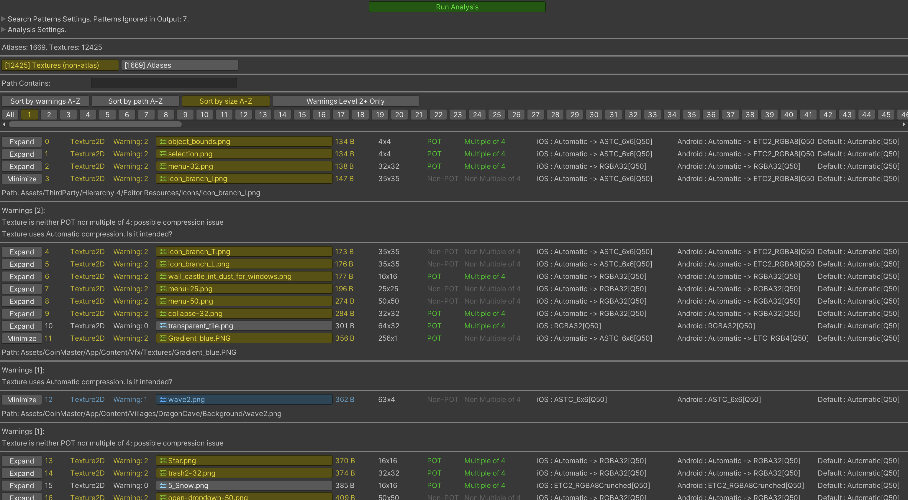
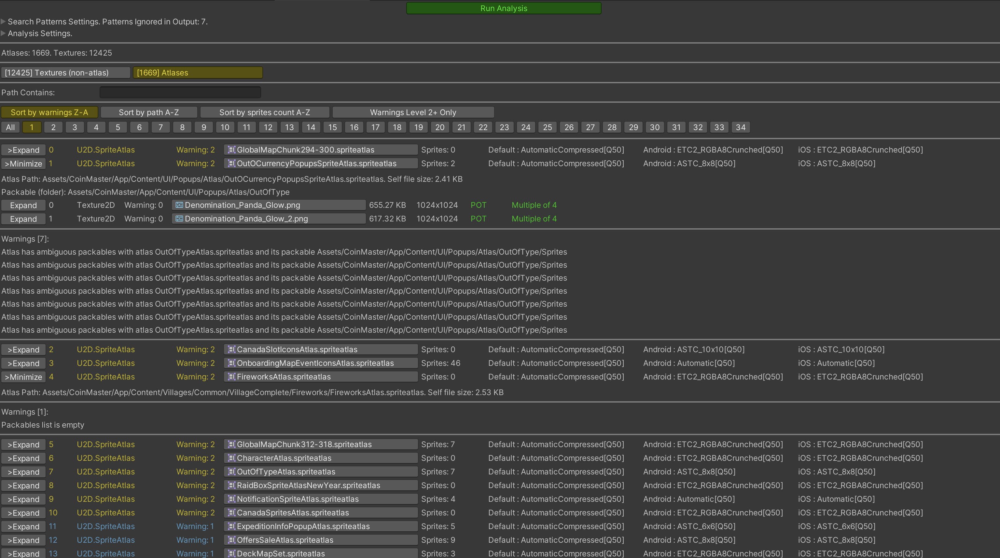

# Textures Hunter Unity3D Tool 

##
This tool provides summary of all textures in Unity project.

It performs an analysis of atlas and non-atlas textures to give some recommendations upon their compression settings:
e.g. detect issues like
- Only POT textures can be compressed to PVRTC format
- Only textures with width/height being multiple of 4 can be compressed to Crunch format
- etc

It also helps to analyze all your atlases at once and highlights issues like
- if their textures used in Resources and/or Addressables (which may lead to duplicated textures in build)
- if there are some ambiguous settings between atlases
- etc

You can set recommended compression settings and it will mark textures and atlases that do not use them.

All code combined into one script for easier portability.
So you can just copy-paste [TextureHunter.cs](./Packages/TextureHunter/Editor/TextureHunter.cs) to your project in any Editor folder.

Use "Tools/Texture Hunter" menu to launch it.

##### Textures View

 

##### Atlases View

 

## Installation

 1. Just copy and paste file [TextureHunter.cs](./Packages/TextureHunter/Editor/TextureHunter.cs) inside Editor folder
 2. [WIP] via Unity's Package Manager 

## Contributions

Feel free to [report bugs, request new features](https://github.com/AlexeyPerov/Unity-Texture-Hunter/issues) 
or to [contribute](https://github.com/AlexeyPerov/Unity-Texture-Hunter/pulls) to this project! 

## Other tools

##### Dependencies Hunter

- To find unreferenced assets in Unity project see [Dependencies-Hunter](https://github.com/AlexeyPerov/Unity-Dependencies-Hunter).

##### Missing References Hunter

- To find missing or empty references in your assets see [Missing-References-Hunter](https://github.com/AlexeyPerov/Unity-MissingReferences-Hunter).

##### Editor Coroutines

- Unity Editor Coroutines alternative version [Lite-Editor-Coroutines](https://github.com/AlexeyPerov/Unity-Lite-Editor-Coroutines).
- Simplified and compact version [Pocket-Editor-Coroutines](https://github.com/AlexeyPerov/Unity-Pocket-Editor-Coroutines).